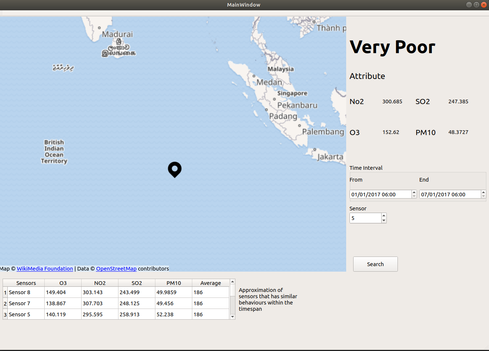
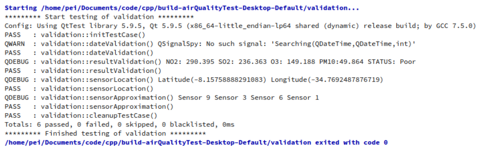

# airQualityProject
AAF Software Engineering
## Software Description
This system is an application software with the main function to determine in a given location and timespan if the air quality is good or bad. The system calculates the four main attribute (O3, SO2, NO2, PM10) values that characterize the air quality in these areas. The data that is retrieved by the system ranges from January to December of 2017. This application allows the user to view the air quality result of a given sensor and timespan with all the average attribute values that characterize the air quality. It also gives users an approximation of sensors with similar attribute values.<br/>

## File Information
* Source Code
  * Source Code
    * cmake_build_debug
      * Executable file for Ubuntu
* airQualityTest
  * Test Class
* SOE_Documents
  * Powerpoint Presentation
  * UML Diagram
  * System Requirment

## Run executable in linux
1. go to cmake_build_debug directory
2. run in terminal
```bash
./airQualityProject_node
```

## Walkthrough
### Input date interval and select sensor


### Result


## Test Result
Test Run with qsignal spy by taking transmission of the variable through the signal.

## Contributing
Pull requests are welcome. For major changes, please open an issue first to discuss what you would like to change.

## License
Copyright (C) 1996, 1999 International Business Machines Corporation and others. All Rights Reserved.


